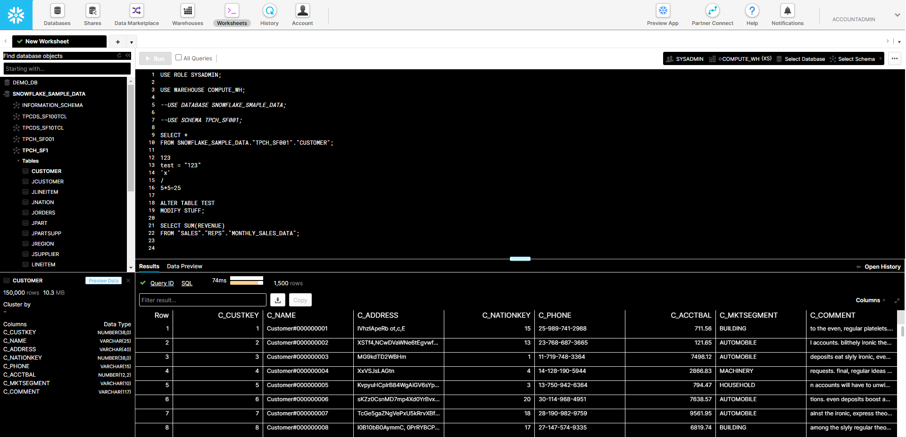
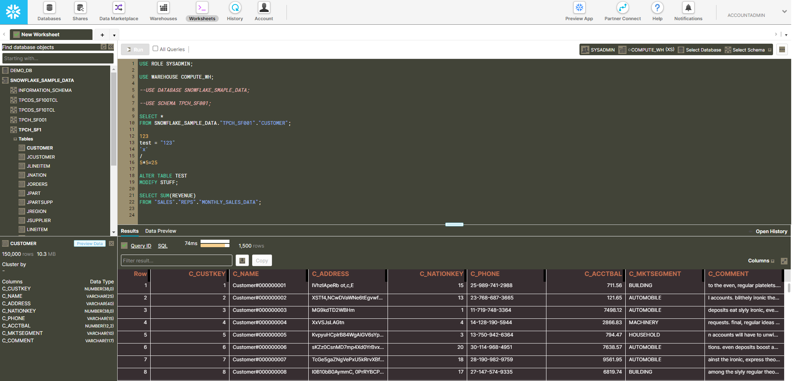

# snowflake-ui-themes
Themes for the Snowflake UI (to be used with a CSS override add-on like Stylebot).

The Snowflake UI is based on the open source [Code Mirror editor](https://codemirror.net/). While Code Mirror has theme support, the themes does not work as-is in Snowflake.

So Martin made a quick adaptation of the Solarized Dark theme for it to work using Stylebot.

#### Solarized Dark Theme

Furthermore, Prathamesh added support for the Black and White Theme and Subtle Grey Theme as below.

#### Black and White Theme

#### Subtle Grey Theme

## Dependencies
- A CSS override add-on, such as [Stylebot](https://chrome.google.com/webstore/detail/stylebot/oiaejidbmkiecgbjeifoejpgmdaleoha?hl=en) for Chrome.
- Either the Inconsolata or the Menlo font installed on your system (or customize the CSS to use your favorite coding font).

## Usage
To add themes to your Snowflake UI:
- Copy the styles found in the chosen theme file (such as snowflake_solarized_dark_theme.css) and paste into Stylebot (or alternative add-on).
- Set the custom stylesheet for your Snowflake instance URL.

## Known Issues
No known issues at this time. Feel free to issue a PR to contribute or create an issue if you find one.

## Change Log
#### 2019-09-09
- Original version.

#### 2020-12-13
- Added subtle grey theme.
- Added black and white theme.
- Added support for Snowflake metadata pane, history pane, and results pane.
