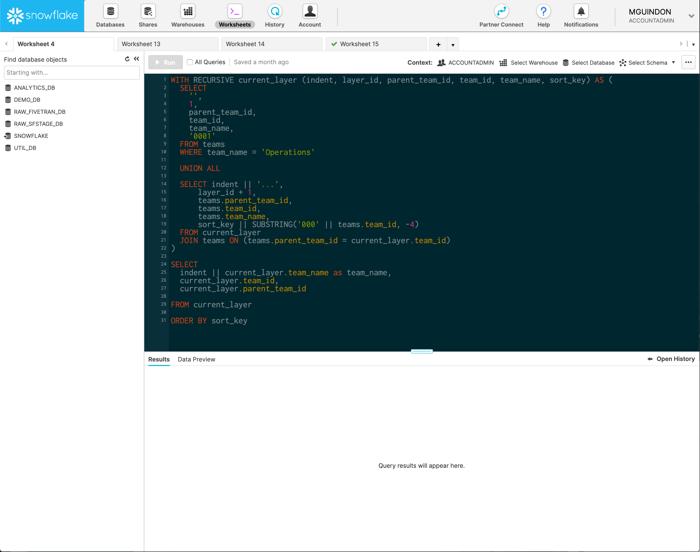

# snowflake-ui-solarized-dark-theme
Solarized Dark theme for the Snowflake UI (to be used with a CSS override add-on like Stylebot).

The Snowflake UI is based on the open source [Code Mirror editor](https://codemirror.net/). While Code Mirror has theme support, the themes does not work as-is in Snowflake. So I made a quick adaptation of the Solarized Dark theme for it to work using Stylebot.

## Dependencies
- A CSS override add-on, such as [Stylebot](https://chrome.google.com/webstore/detail/stylebot/oiaejidbmkiecgbjeifoejpgmdaleoha?hl=en) for Chrome.
- Either the Inconsolata or the Menlo font installed on your system (or customize the CSS to use your favorite coding font).

## Usage
Copy/paste the styles found in the file snowflake.css in Stylebot (or alternative add-on) and set the custom stylesheet for your Snowflake instance URL.

## Known Issues
No known issues at this time. Feel free to issue a PR to contribute or create an issue if you find one.

## Change Log

#### 2019-09-09
- Original version.
